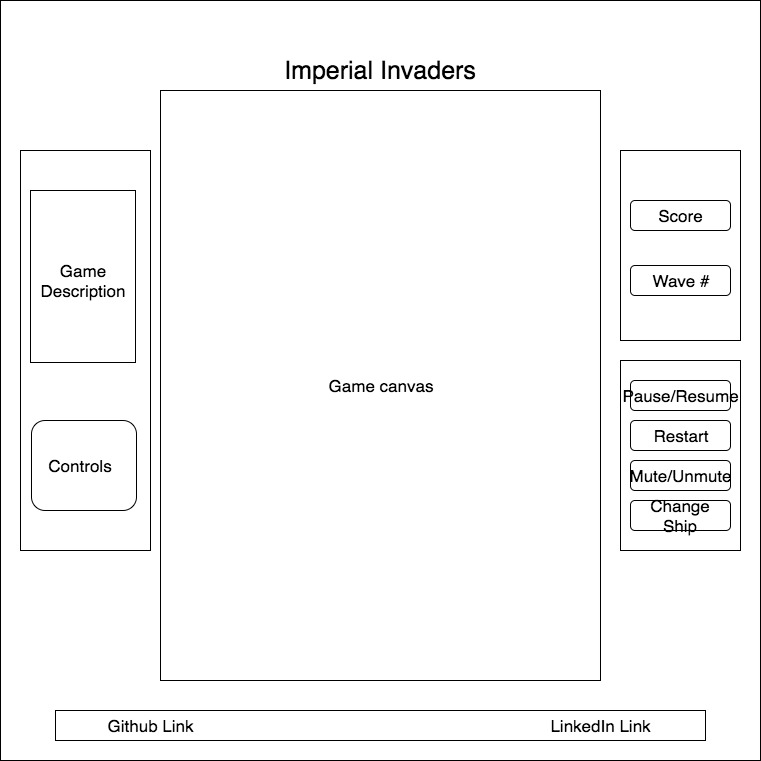

# Imperial Invaders

## Background

An in-browser game based on the classic arcade game [Space Invaders](https://en.wikipedia.org/wiki/Space_Invaders), with a Star Wars twist!

### Instructions

Move your ship back and forth with the left and right arrow keys. Shoot with the space bar.

## Wireframe

This game will be comprised of a single screen with the game canvas, flanked by game instructions and info, with links to my LinkedIn and GitHub pages on the bottom.

## Architecture and Technologies

This project will be implemented with the following technologies:

* Vanilla JavaScript and `jquery` for overall structure and game logic.
* `Easel.js` with `HTML5 Canvas` for DOM manipulation and rendering.
* `jQuery.Hotkeys` for keyboard event handling.
* Webpack to bundle and serve up the various scripts.

In addition to the webpack entry file, the project will include the following scripts:

`Game.js` will handle the logic of creating and rendering the `Easel.js` elements to the DOM as well as store game state variables and provide feedback to the user.

`Player.js` will handle the logic of the player's ship movement and shooting given keyboard input from the player.

`Enemy.js` will handle the logic of the enemy movement and shooting.

`Laser.js` will handle the logic of the projectiles produced by both the player and the enemies.

`Asteroid.js` will handle the logic of the obstacles just above the player area.

## Implementation Timeline

**Day 1**: Set up all necessary Node modules, including installing `Easel.js`. Create `webpack.config.js` nad `package.json`. Write a basic entry file and a skeleton of the scripts outlined above. Goals for Day 1:

* Setup `webpack`
* Gain enough of an understanding of `Easel.js` to render an object to the `Canvas`

**Day 2**: Reinforce my command of the `Easel.js` API, flesh out the relevant object classes and get a rudimentary game running. Goals for Day 2:

* Finish basic game rendering logic
* Work on basic game state storage
* Get a basic game with starting parameters to work

**Day 3**: Finish fleshing out the game, and make changes to improve user experience. Complete styling of the game. If time allows, add extra features, starting with music and sound. Goals for Day 3:

* Test to make sure everything is working as intended

**Day 4**: Finish styling and bug squashing. Last minute optimization and/or finish adding extra features.

## Functionality & MVP

#### Core Functionality

- [ ] Start, pause and reset the game.
- [ ] Move player ship and shoot with the keyboard.
- [ ] Player shots will destroy enemy ships.
- [ ] Enemy ships move and shoot.

#### Extras

- [ ] Background Music and Sound Effects.
- [ ] Players can choose different ship types.
- [ ] Lives/Game Over.
- [ ] Points and extra lives.
- [ ] Levels.
- [ ] Enemy ships explode.
- [ ] Power-ups.
- [ ] Introductory crawl.
